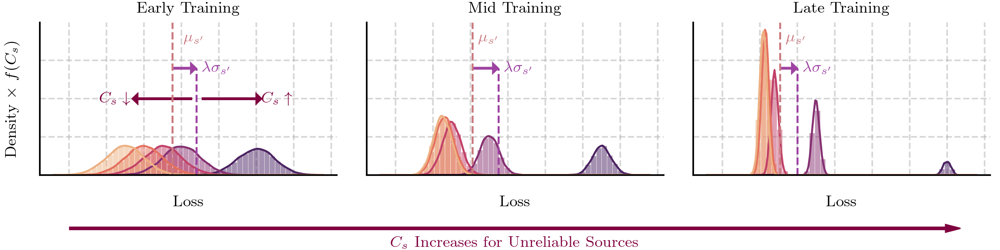

# Training Neural Networks on Data Sources with Unknown Reliability

## Introduction

This repository contains the code for the paper "Training Neural Networks on Data Sources with Unknown Reliability".

### Abstract

When data is generated by multiple sources, conventional training methods update models assuming equal reliability for each source and do not consider their individual data quality during training. However, in many applications, sources have varied levels of reliability that can have negative effects on the performance of a neural network. A key issue is that often the quality of data for individual sources is not known during training. Focusing on supervised learning, this work presents a solution that aims to train neural networks on each data source for a number of steps proportional to the source's estimated relative reliability. This way, we allow training on all sources during the warm-up, and reduce learning on less reliable sources during the final training stages, when it has been shown models overfit to noise. We show through diverse experiments, this can significantly improve model performance when trained on mixtures of reliable and unreliable data sources, and maintain performance when models are trained on reliable sources only.

### Repository information

The notebook (`.ipynb`) files contain the code to load the results and generate the figures and tables presented in the paper, and the python (`.py`) files contain the scripts to produce the results, that are saved in the `outputs` folder.

Within the `loss_adapted_plasticity` folder, are the classes that allow for training with LAP. Within this folder is `SourceGradientWeighting` and `SourceLossWeighting`, which correspond to the two intuitions about training with LAP (you're either scaling gradient contributions, or weight contributions from noisy sources). Both are well documented and provide examples.

Within our code, we mainly use `SourceLossWeighting` since it is more general and is more intuitive to use.

To use `SourceLossWeighting`, you simply need to change your current training loop to the following:

```python
# define the loss weighting with the desired parameters #
loss_weighting = SourceLossWeighting(
    history_length=LAP_HISTORY_LENGTH,
    warmup_iters=WARMUP_ITERS,
    depression_strength=DEPRESSION_STRENGTH,
    leniency=LENIENCY,
)

# ensure that your loss function #
# returns a loss for each sample in the batch #
criterion = nn.LossFunctionOfSomeKind(reduction="none")

for epoch in range(epochs):
    for data, target, sources in train_loader:
        optimizer.zero_grad()
        output = model(data)
        losses = criterion(output, target)
        
        # compute the weighted loss #
        loss = loss_weighting(losses, sources).mean()
        
        loss.backward()
        optimizer.step()
```

The `loss_weighting` object will keep track of the loss history for each source, and will compute the weighted loss for each batch in $O(S \times S_b + B)$ time (where $S$ is the number of unique sources, $S_b$ is the number of unique sources in a batch, and B is the batch size) by computing the weighted mean and standard deviation online. The `loss_weighting` object can be used with any loss function that returns a loss for each sample in the batch and will return a weighted loss for each sample, which can then be reduced (usually by the mean or sum) to get the batch loss used in back-propagation.


## Repository structure

The repository is structured as follows:

```python
source_loss_weighting
==============================
   # data gets downloaded to here
   ├─ data
==============================
   # the code for the *test_synthetic* experiments
   ├─ experiment_code
      # data loading and processing
      ├─ data_utils 
      # model code for the lower-capacity models
      ├─ models 
         ├─ model_code
      # code for testing the experiments
      ├─ testing_utils 
      # code for training the experiments
      ├─ training_utils 
      # general utility code
      ├─ utils 
==============================
   # code to generate figures in the notebooks
   ├─ graph_code 
==============================
   # code used in all experiments to scale the gradients or losses
   ├─ loss_adapted_plasticity
==============================
   # where the results are saved and will be loaded from
   ├─ outputs
      # outputs of 12_california_housing_regression.py
      ├─ california_housing
      # outputs of 4_test_cifar10n_different_noise_presnet.py
      ├─ cifar_10n_different_noise_results
      # outputs of 8_test_cifar10n_different_noise_low_capacity.py
      ├─ cifar_10n_different_noise_results_low_capacity
      # outputs of 7_test_synthetic_different_noise.py
      ├─ cifar_different_noise_results
      # outputs of 3_test_ecg_different_noise.py
      ├─ ecg_results
      # graphs from the notebooks
      ├─ graphs 
      # outputs of 11_imagenet64_random_label_and_noise.py
      ├─ imagenet64_random_label_and_noise
      # outputs of 5_test_nlp_random_label.py
      ├─ imdb_random_label
      # outputs of 2_test_presnet.py and baselines
      ├─ presnet_results
         ├─ baseline
            ├─ rrl
      # outputs of 1_test_synthetic.py and baselines
      ├─ synthetic_results
         ├─ baseline
            ├─ arfl
               ├─ cifar10
               ├─ cifar100
               ├─ fmnist
         ├─ co-teaching
         ├─ idpa
      # outputs of 6_test_synthetic_batches_multiple_source.py
      ├─ synthetic_results_batch_multiple_sources
      # outputs of 9_test_synthetic_batches_multiple_source_varied_sizes.py
      ├─ synthetic_results_batch_multiple_sources_varied_sizes
      # outputs of 10_tiny_imagenet_random_label.py
      ├─ tiny_imagenet_random_label
      # outputs of 0_test_hparams.ipynb
      ├─ toy_example
==============================
```


## Requirements

This code was tested with Python 3.11.5 and the required python packages are located in the `requirements.txt` file. To install them, run: 

``` bash
pip install -r requirements.txt
```

This will install the following packages and versions, which were the ones this code was tested with:

```python
numpy==1.26.2
pandas==2.1.3 
pyarrow==14.0.2
tqdm==4.66.1
requests==2.31.0
matplotlib==3.8.2
seaborn==0.13.0
pyyaml==6.0.1
scikit-learn==1.3.2
torch==2.1.1
torchvision==0.16.1
torchtext==0.16.0
tensorboard==2.15.1
catalyst==22.4
datasets==2.19.0
wfdb==4.1.2
faiss-cpu==1.7.4
```

### Just the LAP code

If you just want to install the requirements for the gradient and loss scaling functionality, you just the following (tested with the versions given in Python 3.11.5, but will most likely work with other versions):

```python
numpy==1.26.2
torch==2.1.1
torchvision==0.16.1
tensorboard==2.15.1
```


## Running the experiments in the paper

All figures will be saved in `outputs/graphs`, whilst all tables will be displayed within the corresponding notebook.

All results are contained within this repository, and so if you want to load them without re-running experiments, see the relevant notebook for the figure or table you are interested in.

### Data

The data for the experiments is downloaded automatically when running the scripts. The data is saved in the `data` folder, which is created in the root directory of the repository. However, for Imagenet and Tiny-Imagenet, since a license agreement must be accepted, this is required first. Two scripts exist in the data folder to download the data for these datasets. The script `download_imagenet.txt` will download the Imagenet data, and the script `download_tiny_imagenet.txt` will download the Tiny-Imagenet data. These scripts should be run from the `data` folder and download the data into a structure that the Pytorch datasets in the respective experiment scripts expect.

### Figure 1

Figure 1 is produced by running the code in `0_lap_demonstration.ipynb`, which involves a synthetically produced graph to demonstrate the intuitions behind how LAP works.

<div align="center">

</div>


### Figure 2

The results that produce Figure 2 can be run using the `0_test_hparams.ipynb` notebook. This will save the results in `outputs/toy_example/`. These results can then be loaded, and the figure generated, by running the code in `0_test_hparams.ipynb`.

<div align="center">

</div>


### Table 1

The results in Table 1 are generated by running the `1_test_synthetic.py` script. Given the dataset name, noise type, and model, this will run the experiments using LAP training and the standard training methods. The results will be saved in `outputs/synthetic_results/` as a csv file. These results can then be loaded, and the table generated, by running the code in `1_test_synthetic.ipynb`.

To run all of the experiments with LAP enabled and disabled in Table 1, please run the batch file `1_test_synthetic.txt`. A single experiment can be run for example using:

```bash
python 1_test_synthetic.py --model-name [MODEL_NAME]-[CORRUPTION_TYPE]-drstd --dataset-name [DATASET_NAME] --seed 2 4 8 16 32 --n-sources 10 --n-corrupt-sources 4 --source-size 128 --depression-strength 1.0 --leniency 0.8 --history-length 25 --n-epochs 25 -v
```

Where:
- `DATASET_NAME` is the name of the dataset to use:
   - `cifar10` for CIFAR-10
   - `cifar100` for CIFAR-100
   - `fmnist` for F-MNIST
- `MODEL_NAME` is the name of the model to use:
   - `Conv3Net` for CIFAR-10
   - `Conv3Net_100` for CIFAR-100
   - `MLP` for F-MNIST
- `CORRUPTION_TYPE` is the type of noise to use:
   - `no_c`: No Corruption
   - `c_cs`: Chunk Shuffle
   - `c_rl`: Random Label
   - `c_lbs`: Batch Label Shuffle
   - `c_lbf`: Batch Label Flip
   - `c_ns`: Added Noise
   - `c_no`: Replace With Noise

The baseline results are saved in `outputs/synthetic_results/baseline/` and are produced by running the `synthetic_baseline_experiments.py` script found in either `baseline/coteaching` for Co-teaching or `baseline/idpa` for IDPA.


### Table 2

The results in Table 2 are produced by running `2_test_presnet.py`. This will run the experiments using LAP training only.

The code in `2_test_presnet.ipynb` can be used to produce the table in the paper, which will also load the baseline results located in `outputs/presnet_results/baseline/`.

An example command to run `2_test_presnet.py`:
   
```bash
python 2_test_presnet.py --seed 2 --runs 1 2 3 4 5 --device cuda
```

The baseline results are saved in `outputs/presnet_results/baseline/` and are produced by running the `synthetic_baseline_experiments.py` script found in `baseline/rrl`.


### Figure 3a

The results shown in Figure 3a can be produced by running the `3_test_ecg_different_noise.py` script. This will run the experiments using LAP training and the standard training methods applied to a 1D ResNet on the ECG dataset tested (PTB-XL). The results will be saved in `outputs/ecg_results/`.

The figure itself can be produced by running the code in `3_test_ecg_different_noise.ipynb`, which will load and process the results before plotting and saving the figure.

<div align="center">

</div>

An example command to run `3_test_ecg_different_noise.py`:

```bash
python 3_test_ecg_different_noise.py --seed 2 --runs 1 2 3 4 5 --device cuda
```

### Figure 3b

The results shown in Figure 3b are produced by running the script `4_test_cifar10n_different_noise_presnet.py`, which will run the RRL baseline with and without LAP training on CIFAR-10N with varied noise levels. The results of this will be saved in `outputs/cifar_10n_different_noise_results/`.

These results will be loaded and processed to produce Figure 3 by running the code provided in `4_test_cifar10n_different_noise_presnet.ipynb`.

<div align="center">

</div>


An example command to run `4_test_cifar10n_different_noise_presnet.py`:

```bash
python 4_test_cifar10n_different_noise_presnet.py --seed 2 --runs 1 2 3 4 5 --device cuda
```

### Table 3 

The results in Table 3 are generated by running the script `5_test_nlp_random_label.py`, which will run the natural language task on the IMDB dataset, which will be automatically downloaded. These results will be saved in `outputs/imdb_random_label/`.

To produce the table, please run the code in `5_test_nlp_random_label.ipynb`, which will load and process the results before generating the table.

An example command to run `5_test_nlp_random_label.py`:

```bash
python 5_test_nlp_random_label.py --seed 2 --runs 1 2 3 4 5 --device cuda
```

The baseline results are also saved in `outputs/imdb_random_label/` and are produced by running the `IMDB_baseline_experiments.py` script found in either `baseline/coteaching` for Co-teaching or `baseline/idpa` for IDPA.


### Table 4

The results in Table 4 are generated by running the script `6_test_synthetic_batches_multiple_source.py`, which will run the same CIFAR-10 experiments as in Table 1, except with shuffling of sources across batches. These results will be saved in `outputs/synthetic_results_batch_multiple_sources/`.

To produce the table, please run the code in `6_test_synthetic_batches_multiple_source.ipynb`, which will load and process the results before generating the table.

An example command to run `6_test_synthetic_batches_multiple_source.py`:

```bash
python 6_test_synthetic_batches_multiple_source.py --seed 2 --runs 1 2 3 4 5 --device cuda
```

The baseline results are saved in `outputs/synthetic_results_batch_multiple_sources/baseline/` and are produced by running the `synthetic_baseline_experiments.py` script found in either `baseline/coteaching` for Co-teaching or `baseline/idpa` for IDPA with the flag `--multiple_sources_in_batch`.


### Table 5

The results in Table 5 are generated using the script `7_test_synthetic_different_noise_presnet.py`. This will run the experiments using LAP training and the standard training methods applied to RRL (a baseline from our paper) on CIFAR-10. The results will be saved in `outputs/cifar_different_noise_results/`. 

These results can then be loaded, and the table generated, by running the code in `7_test_synthetic_different_noise.ipynb`.

An example command to run `7_test_synthetic_different_noise_presnet.py`:

```bash
python 7_test_synthetic_different_noise_presnet.py --corruption_level 0.5 --seed 2 --runs 1 2 3 4 5 --device cuda
```


### Figure 4

The results in Figure 4 are generated by running the script `8_test_cifar10n_different_noise_low_capacity.py`, which will run the same experiment as in Figure 3b, except with the lower capacity model used to produce the results in Table 1. These results will be saved in `outputs/cifar_10n_different_noise_results_low_capacity/`.

To produce the figure, please run the code in `8_test_cifar10n_different_noise_low_capacity.ipynb`, which will load and process the results before plotting and saving the figure.

<div align="center">

</div>


An example command to run `8_test_cifar10n_different_noise_low_capacity.py`:

```bash
python 8_test_cifar10n_different_noise_low_capacity.py --seed 2 --runs 1 2 3 4 5 --device cuda
```


### Table 6

The results in Table 6 are generated using the script `9_test_synthetic_batches_multiple_source_varied_sizes.py`. This will run the CIFAR-10 experiments using LAP training with much larger numbers of sources. The results will be saved in `outputs/synthetic_results_batch_multiple_sources_varied_sizes`. 

These results can then be loaded, and the table generated, by running the code in `9_test_synthetic_batches_multiple_source_varied_sizes.ipynb`. This will also load the baseline results from Table 4, since the experiments are the same, but with varied source sizes which do not affect the baselines.

An example command to run `9_test_synthetic_batches_multiple_source_varied_sizes.py`:

```bash
python 9_test_synthetic_batches_multiple_source_varied_sizes.py --seed 2 --runs 1 2 3 4 5 --device cuda
```


### Table 7


The results in Table 7 are generated using the script `10_tiny_imagenet_random_label.py`. This will run the Tiny-Imagenet experiments using LAP training for the original data and random labelling. The results will be saved in `outputs/tiny_imagenet_random_label`. 

These results can then be loaded, and the table generated, by running the code in `10_tiny_imagenet_random_label.ipynb`.

An example command to run `10_tiny_imagenet_random_label.py`:

```bash
python 10_tiny_imagenet_random_label.py --seed 2 --runs 1 2 3 4 5 --device cuda --scheduler
```


### Table 8, Table 9, and Figure 5


The results in Table 8, Table 9, and Figure 5 are generated using the script `11_imagenet64_random_label_and_noise.py`. This will run the Imagenet experiments using LAP training for the original data and random labelling. The results will be saved in `outputs/imagenet64_random_label_and_noise`. 

These results can then be loaded, and the table and figure generated, by running the code in `11_imagenet64_random_label_and_noise.ipynb`.


<div align="center">
   <div style="display: inline-block">
   
   </div>
   <div style="display: inline-block" >
   
   </div>
   <div style="display: inline-block">
   
   </div>
</div>


An example command to run `11_imagenet64_random_label_and_noise.py`:

```bash
python 11_imagenet64_random_label_and_noise.py --seed 2 --runs 1 2 3 4 5 --device cuda --scheduler
```


### Table 10


The results in Table 10 are generated using the script `12_california_housing_regression.py`. This will run the regression experiments on the California Housing dataset using LAP training for the original data and random labelling. The results will be saved in `outputs/california_housing`. 

These results can then be loaded, and the table generated, by running the code in `12_california_housing_regression.ipynb`.

An example command to run `12_california_housing_regression.py`:

```bash
python 12_california_housing_regression.py --seed 2 --runs 1 2 3 4 5 --device cuda
```
